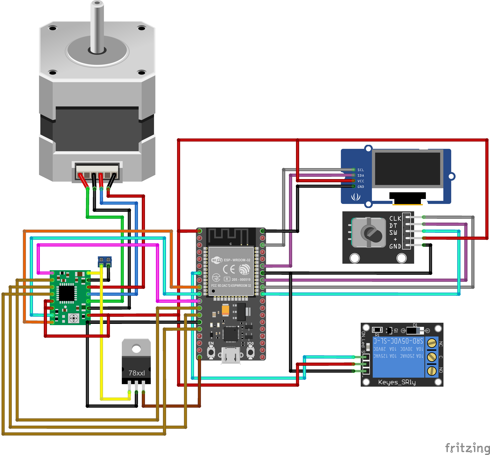

# Controlador de Motor de Passo com Menu via Encoder e Display OLED

> Um sistema de controle preciso para motores de passo, com interface de usuário baseada em menu, desenvolvido para a plataforma ESP32 com PlatformIO.
> 

Este projeto oferece um controle detalhado para um motor de passo, utilizando um encoder rotativo para navegar por um menu de funções em um display OLED. O sistema é ideal para aplicações que exigem movimentos precisos e repetitivos, como em gabaritos, sistemas de automação de pequeno porte ou equipamentos de teste.

O usuário pode executar um ciclo completo de operação, posicionar o motor em um passo específico, ajustar a resolução do passo (micro-passo), configurar o tempo de acionamento de um relé e desabilitar o motor para movimento livre.

*Última atualização: 15 de Julho de 2025*

## ✨ Funcionalidades Principais

- **Interface de Menu Intuitiva:** Todas as funções são acessadas através de um menu no display OLED, controlado pelo encoder rotativo.
- **Ciclo de Operação Completo:** Executa uma volta completa, acionando um relé em cada passo por um tempo configurável.
- **Posicionamento Preciso:** Permite ao usuário escolher um passo exato (posição) para o qual o motor deve se mover.
- **Movimento Otimizado:** O motor sempre gira pelo caminho mais curto para alcançar a posição de destino.
- **Configuração de Micro-passo:** Suporte para ajustar a resolução do motor (Full, Half, 1/4, 1/8, e 1/16), permitindo um movimento mais suave e preciso.
- **Ajuste do Tempo do Relé:** O tempo em que o relé permanece ativo durante o ciclo completo pode ser ajustado e salvo pelo usuário.
- **Torque de Parada (Holding Torque):** As bobinas do motor permanecem energizadas na posição de destino para resistir a movimentos externos.
- **Modo de Giro Livre:** O motor pode ser facilmente desabilitado pelo menu para permitir o giro livre do eixo.
- **Altamente Configurável:** Pinos, passos do motor e outros parâmetros podem ser facilmente alterados no arquivo `config.h`.

## 🛠️ Componentes Necessários

| Componente | Quantidade | Observações |
| --- | --- | --- |
| ESP32 Dev Kit | 1 | Placa principal do projeto. |
| Driver de Motor de Passo A4988 | 1 | Ou similar (a lógica de micro-passo é para o A4988). |
| Motor de Passo NEMA 17 | 1 | Modelo de 200 passos/volta (1.8°). |
| Encoder Rotativo com Botão | 1 | Para entrada do usuário. |
| Display OLED I2C 0.96" | 1 | Modelo SSD1306 (128x64). |
| Módulo Relé 5V | 1 | Para acionar cargas externas. |
| Fonte de Alimentação Externa | 1 | Tensão e corrente compatíveis com o motor (ex: 12V 2A). |
| Cabos Jumper | Vários | Para realizar as conexões. |

## 📦 Software e Bibliotecas

Este projeto foi desenvolvido utilizando **PlatformIO** com o Visual Studio Code. As bibliotecas necessárias são gerenciadas automaticamente pelo `platformio.ini`.

- `adafruit/Adafruit GFX Library`: Biblioteca gráfica base para o display.
- `adafruit/Adafruit SSD1306`: Driver para o display OLED de 0.96".
- `Wire`: Para comunicação I2C com o display.

O projeto utiliza classes personalizadas (`StepperController`, `DisplayManager`, `EncoderHandler`) para modularizar o código, não dependendo de bibliotecas de motor externas como a AccelStepper.

## 🔌 Diagrama de Conexão (Wiring)

**Atenção:** A alimentação do motor (`VMOT` no A4988) **DEVE** vir de uma fonte externa. Não utilize o pino 5V/VIN do ESP32 para alimentar o motor. Conecte o GND da fonte externa ao GND do ESP32.

| Componente | Pino do Componente | Pino do ESP32 |
| --- | --- | --- |
| **Driver A4988** | `ENABLE` | `GPIO 27` |
|  | `STEP` | `GPIO 26` |
|  | `DIR` | `GPIO 25` |
|  | `MS1` | `GPIO 14` |
|  | `MS2` | `GPIO 12` |
|  | `MS3` | `GPIO 13` |
|  | `GND` | `GND` |
|  | `VDD` (Lógica) | `3.3V` ou `5V` |
|  | `VMOT` (Motor) | `+` da Fonte Externa |
|  | `GND` (Motor) | `-` da Fonte Externa |
| **Encoder** | `CLK` | `GPIO 18` |
|  | `DT` | `GPIO 19` |
|  | `SW` (Botão) | `GPIO 5` |
|  | `+` | `3.3V` |
|  | `GND` | `GND` |
| **Display OLED** | `SCL` | `GPIO 22` (Padrão I2C) |
|  | `SDA` | `GPIO` 21 (Padrão I2C) |
|  | `VCC` | `3.3V` |
|  | `GND` | `GND` |
| **Módulo Relé** | `IN` (Sinal) | `GPIO 32` |
|  | `VCC` | `5V` |
|  | `GND` | `GND` |



## 📁 Estrutura do Projeto

O projeto está organizado em classes para facilitar a manutenção e a leitura do código.

```
.
├── platformio.ini         // Arquivo de configuração do PlatformIO
├── include
│   ├── config.h           // Configurações de pinos e parâmetros globais
│   ├── logo.h             // Bitmap da imagem de boot
│   ├── DisplayManager.h   // Cabeçalho da classe de controle do Display
│   ├── EncoderHandler.h   // Cabeçalho da classe de controle do Encoder
│   └── StepperController.h// Cabeçalho da classe de controle do Motor
└── src
    ├── main.cpp           // Lógica principal, máquina de estados e menus
    ├── DisplayManager.cpp   // Implementação da classe do Display
    ├── EncoderHandler.cpp   // Implementação da classe do Encoder
    └── StepperController.cpp// Implementação da classe do Motor

```

## ⚙️ Configuração

Antes de carregar o código, você pode verificar as configurações no arquivo `include/config.h` para que correspondam ao seu hardware.

### Mapeamento de Pinos

Se você precisar usar outros pinos no ESP32, pode alterá-los facilmente no `config.h`.

```
// --- Pinos de Controle de Micro-passo (A4988) ---
#define MS1_PIN         14
#define MS2_PIN         12
#define MS3_PIN         13

// Configurações do Motor de Passo
#define STEP_PIN        26
#define DIR_PIN         25
#define ENABLE_PIN      27

// Configurações do Encoder
#define ENCODER_CLK     18
#define ENCODER_DT      19
#define ENCODER_SW      5

// Configurações do Relé
#define RELAY_PIN       32

```

## 🚀 Como Usar

A operação do dispositivo é totalmente guiada pelo menu no display.

1. **Ligar o Dispositivo**
    - Ao receber energia, o display mostrará um logo por 2.5 segundos.
    - Em seguida, o Menu Principal será exibido.
2. **Navegando no Menu**
    - 🔄 **Girar o encoder:** Move o cursor de seleção (`>`) para cima ou para baixo na lista de opções. O menu rola automaticamente se houver mais itens do que o visível na tela.
    - 🖱️ **Pressionar o encoder (clique curto):** Seleciona a opção destacada.
3. **Opções do Menu**
    - **1. Ciclo Completo:**
        - Inicia um ciclo que dá uma volta completa no motor.
        - Em cada passo, o relé é ativado, o sistema aguarda um tempo (`RELAY_ON_TIME`), o relé é desativado e o motor avança para o próximo passo.
        - O progresso é exibido no display.
        - Pressione o encoder a qualquer momento para cancelar e retornar ao menu.
    - **2. Posicionamento:**
        - Leva a uma tela para definir um passo de destino.
        - Gire o encoder para selecionar o número do passo desejado. O total de passos disponíveis depende da configuração de micro-passo.
        - Pressione para confirmar. O motor se moverá para a posição e permanecerá travado.
    - **3. Micro-passo:**
        - Abre um menu para selecionar a resolução do motor (Full, 1/2, 1/4, 1/8 ou 1/16).
        - Uma resolução maior (ex: 1/16) resulta em mais passos por volta e um movimento mais suave.
        - Selecione uma opção e pressione para aplicar e voltar ao menu principal. A posição do motor será zerada.
    - **4. Tempo do Relé:**
        - Permite ajustar o tempo (em milissegundos) que o relé fica acionado durante o "Ciclo Completo".
        - Gire o encoder para aumentar ou diminuir o valor.
        - Pressione para salvar e voltar ao menu.
    - **5. Desligar Motor:**
        - Desativa as bobinas do motor, permitindo que o eixo seja girado manually (modo livre).
        - O display indicará "MOTOR DESLIGADO".
        - Para reativar, pressione o botão do encoder. O sistema voltará ao menu principal e habilitará o motor.

## 🔮 Melhorias Futuras

- [ ]  Salvar a última posição e as configurações de micro-passo e relé na memória NVS (EEPROM) do ESP32 para que não se percam ao desligar.
- [ ]  Adicionar um submenu de configurações para ajustar velocidade e aceleração do motor.
- [ ]  Implementar controle não-bloqueante do motor para que a interface continue responsiva durante o movimento.
- [ ]  Adicionar suporte a um sensor de fim de curso (`endstop`) para um ciclo de "homing" preciso.

## 📝 Licença

Este projeto é distribuído sob a Licença MIT.

Copyright (c) 2025 [Lucas Salomão]